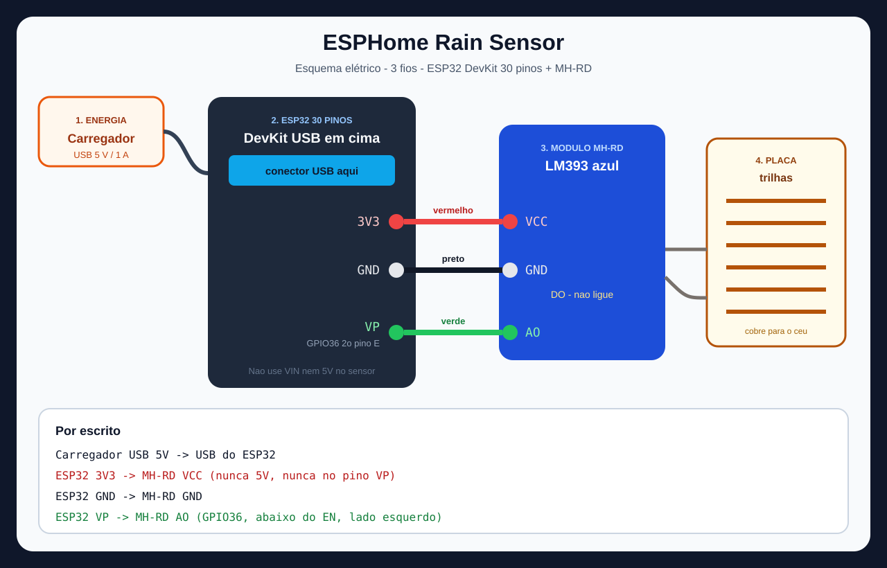
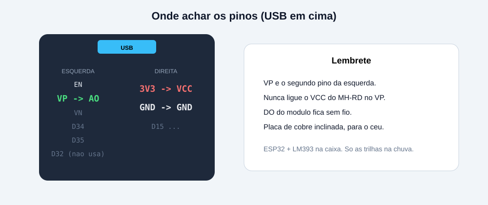

# ESPHome Rain Sensor

[PT](README.md) | [EN](README.en.md) | **ES**

[](https://ko-fi.com/G7B227FYIH)

Detector de lluvia barato con **ESP32** + modulo **MH-RD** + Home Assistant (ESPHome).

No es un pluviometro: no mide milimetros. Indica si la placa esta mojada y puede disparar automatizaciones.

Alimentacion: **cargador USB de movil** en el DevKit. **3 cables.** El pin **DO queda suelto**.





## Material

- ESP32 DevKit de **30 pines** (DOIT / WROOM-32)
- Kit raindrops **MH-RD** (placa de pistas + placa azul LM393)
- 3 jumpers + los 2 cables de la placa de pistas
- Cargador USB 5 V / 1 A y cable
- PC con Python (para grabar) y Home Assistant (Docker o HAOS)

## Conexion por escrito

USB del cargador en el **USB del ESP32**. Luego:

```
ESP32  3V3   ->  MH-RD  VCC
ESP32  GND   ->  MH-RD  GND
ESP32  VP    ->  MH-RD  AO      GPIO36 (2o pin de la izquierda, USB arriba, debajo de EN)

MH-RD  S+ / S-  ->  placa de pistas
MH-RD  DO           sin cable
```

| Cable | De | A | Funcion |
| --- | --- | --- | --- |
| Rojo | 3V3 | VCC | 3,3 V al modulo |
| Negro | GND | GND | Tierra |
| Verde | VP | AO | Tension = humedad |

**No** conecte VCC a 5 V, VIN ni VP.

En el tejado: cobre hacia el cielo, placa a 30-45 grados, conector arriba. ESP y LM393 en una caja.

## Como el firmware decide lluvia

AO baja al mojarse (~3,2 V seco a ~1,2 V empapado), lectura cada 1 s.

| Entidad | Funcion |
| --- | --- |
| **Chuva** (Lluvia) | On si V &lt; 2,50 V durante 2 s. Off si V &gt; 2,90 V durante 20 s |
| **Umidade da placa** | 3,17 V = 0 % · 1,25 V = 100 % |
| **Estado** | Chovendo / Seco |
| **Última chuva** | Fecha/hora del ultimo on, o **Nunca** |

Automatizaciones: sensor binario **Chuva** o evento `esphome.its_raining`. No use el %.

El trimpot solo mueve el LED de DO. Sin cable DO, ignórelo.

---

## 1. Instalar ESPHome en Windows

Home Assistant en **Docker no tiene add-on**. Grabe desde este PC.

1. Instale [Python](https://www.python.org/downloads/). Marque **Add python.exe to PATH**.
2. PowerShell:

```powershell
pip install esphome
```

3. Clone:

```powershell
git clone https://github.com/th3junior/ESPHome-Rain-Sensor.git
cd ESPHome-Rain-Sensor\esphome
```

## 2. Generar la clave de API

La clave cifra ESP &lt;-&gt; Home Assistant (32 bytes Base64).

**Windows (PowerShell):**

```powershell
python -c "import secrets,base64; print(base64.b64encode(secrets.token_bytes(32)).decode())"
```

**Linux / macOS:**

```bash
openssl rand -base64 32
```

Copie la linea entera (termina en `=`).

## 3. Crear secrets.yaml

```powershell
copy secrets.yaml.example secrets.yaml
notepad secrets.yaml
```

Rellene:

```yaml
wifi_ssid: "nombre de su red"
wifi_password: "clave wifi"
api_encryption_key: "pegue la clave del paso 2"
fallback_password: "minimo8chars"
```

No suba `secrets.yaml` a GitHub.

La misma `api_encryption_key` sirve para API y OTA.

## 4. Grabar la placa

Conecte el ESP32 a este PC (ya con los 3 cables en el MH-RD).

```powershell
cd ESPHome-Rain-Sensor\esphome
esphome run rain-sensor.yaml
```

Si pide puerto, elija **COMx** (Silicon Labs CP210x), no OTA.

Si falla: mantenga **BOOT**, ejecute de nuevo, suelte cuando empiece a grabar.

En el log espere:

```
WiFi Connected
IP Address: 192.168.x.x
```

Anote la IP.

## 5. Anadir en Home Assistant

1. **Ajustes → Dispositivos y servicios → Anadir integracion → ESPHome**
2. **Host:** la IP del log (o `rain-sensor.local`)
3. **Puerto:** `6053`
4. Pegue la **misma** `api_encryption_key` de `secrets.yaml`

Si pide Host y la placa aun no esta grabada, cancele: esa pantalla no graba firmware.

**IP fija:** reserve la MAC del ESP en el router. Si no, el DHCP puede cambiar y cae la integracion.

Entidades: Chuva, Umidade da placa, Estado, Última chuva. El resto es diagnostico.

## 6. Probar

Placa tumbada, **cobre hacia arriba**.

1. Seco: Lluvia off, tension ~2,8-3,2 V, % bajo.
2. Agua **en las pistas** (no solo en el conector): en ~2 s Lluvia on, baja la tension, sube el %.
3. Seque: en ~20 s vuelve a off.

## 7. Dashboard (opcional)

```yaml
type: vertical-stack
cards:
  - type: glance
    title: Lluvia
    entities:
      - entity: binary_sensor.detector_de_chuva_chuva
        name: Lluvia
      - entity: sensor.detector_de_chuva_umidade_da_placa
        name: Humedad
      - entity: sensor.detector_de_chuva_estado
        name: Estado
  - type: gauge
    entity: sensor.detector_de_chuva_umidade_da_placa
    min: 0
    max: 100
    needle: true
  - type: entities
    entities:
      - text_sensor.detector_de_chuva_ultima_chuva
      - sensor.detector_de_chuva_tensao_da_placa
      - sensor.detector_de_chuva_ip
```

Si HA genero otros IDs, use esos.

## 8. Automatizacion

```yaml
automation:
  - alias: Empezo a llover
    trigger:
      - platform: event
        event_type: esphome.its_raining
    action:
      - action: persistent_notification.create
        data:
          message: Detector de lluvia activado
```

O `binary_sensor.detector_de_chuva_chuva` → `on`.

## Sensibilidad

En `esphome/rain-sensor.yaml`:

```yaml
  rain_voltage_wet: "2.50"   # por debajo = lluvia
  rain_voltage_dry: "2.90"   # por encima = seco
```

Mas sensible: suba `wet` (ej. `2.70`). Grabe otra vez con `esphome run`.

## Problemas

| Sintoma | Que revisar |
| --- | --- |
| Tension ~0,14 V | AO suelto o no en **VP** |
| HA: unable to connect / falta `api` | Placa sin firmware, IP incorrecta (este YAML no duerme) |
| Wi-Fi no conecta | `secrets.yaml`; AP `ESPHome Rain Fallback` |
| La lluvia no cambia | Agua en el **cobre**, cruzando pistas |
| Fallo al grabar USB | BOTON BOOT; cable de datos |

## Licencia

MIT. Copyright (c) 2026 [th3junior](https://github.com/th3junior). Ver [LICENSE](LICENSE).
